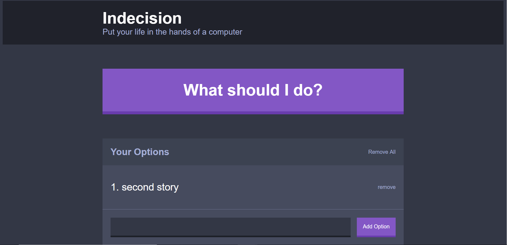

# Indecision

Indecision is a very fun app that can be used to help make decisions. &nbsp; Once deployed, it gives the option to enter in several choices and lets the app pick for you.     

### Getting Started 

To get things moving, copy the file using Clone/download in github.&nbsp; In your bash window do a git clone and paste the copied link to the repo.

### Installing: Once it is cloned to the local machine, open in a text editor.
 

    yarn install

### Running the program

    yarn run dev-server

### Deployment

To check if its working properly, you should see this image in your browser:   

 
 
 
 

If your browser looks like this, congratulations the app is working properly!  

Built With:

React.JS 
 